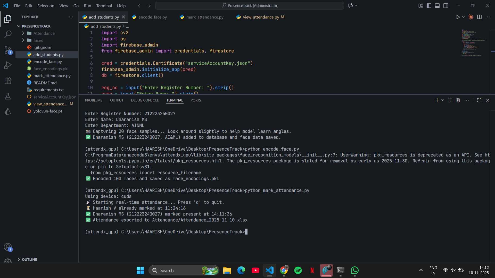

# PresenceTrack

PresenceTrack is a real-time attendance system that leverages computer vision and deep learning to automate attendance marking. Using a combination of YOLOv8 for fast face detection and face_recognition for identification, it provides a highly accurate and efficient solution for classrooms, offices, and events. Attendance data is stored securely in Firebase Firestore.

## Features

- Real-time face detection using YOLOv8

- Accurate face recognition with face encodings

- Automatic attendance marking in Firebase Firestore

- GPU support for faster processing

- Supports multiple users simultaneously

- Easy addition of new students with face data capture

## Installation
1.Create a virtual environment and activate it:

```
conda create -n track python=3.10
conda activate track
```
2.Install dependencies:

```
pip install -r requirements.txt
```
3.Add your Firebase service account key:
- Place serviceAccountKey.json in the project root. (Do not push it to GitHub)

## Usage
Step 1: Add Students Details and Capture Faces

```
python add_students.py
```
 Step 2: Encode Faces (generate face_encodings.pkl used for recognition.)
```
python encode.py
```


 Step 3: Mark Attendance
```
python mark_attendance.py
```
 Press q to quit.


 Step 4: View Attendance
```
python view.attendance.py
```
Enter the date in (YYYY-MM-DD) format

# Output
